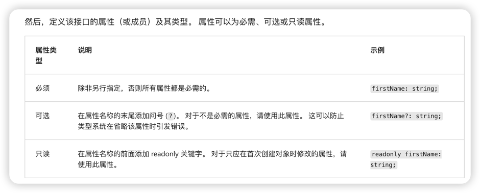

# typescript_study
# 🍱

##TypeScript 中的类型和子类型

TypeScript 中的所有类型都是单个顶级类型的子类型，称为 any 类型。 any 类型是可以无限制地表示任何 JavaScript 值的一种类型。 所有其他类型都可分类为基元类型、对象类型或类型参数。 这些类型将对其值引入各种静态约束

Start to study typescript language！

## 什么是接口

接口是用来描述对象，命名和参数化对象的一种类型。以及可以整合现有的命名的对象组装成新的对象类型。

## 接口定义

## 类与接口的定义区别
类是一堆抽象概念的集合，接口是对一个对象的一系列行为和方法的描述.
目前理解：类和接口的区别感觉不大，类需要实例化后才能进行调用，并且类可以确定自己成员的可见属性
接口只能去定义对象的一些属性和方法，只能确定当前对象有这些方法，你传入符合接口的参数后那么你就实现了这个接口，但是你没法控制当前接口的可访问性，可见性，不能说不能只是不那么方便

## js与ts类的区别

1. js的class中不存在private,public,protected等变量修饰符，只有static修饰符
2. ts中有上面这些修饰符
3. ts中构造函数constructor中的this进行赋值的操作，声明变量在构造函数外面，不能在构造函数里面声明
4. js中类支持在构造函数内部或者外部进行赋值类成员的操作
5. js中类成员的私有化只能自己去定义规避，比如定义_name,下划线区别。
